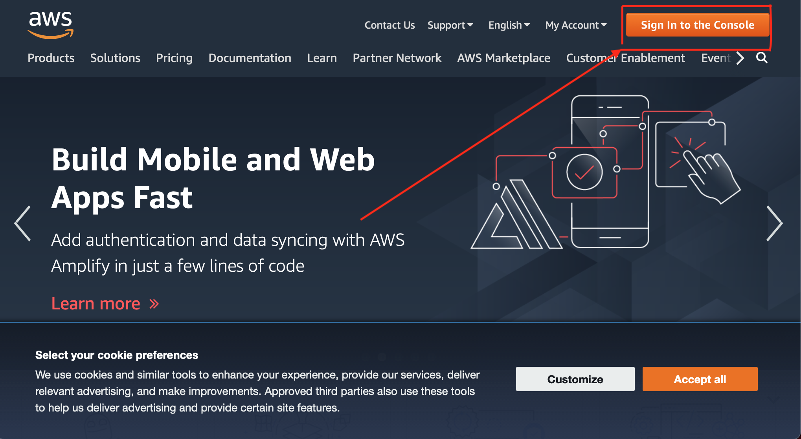
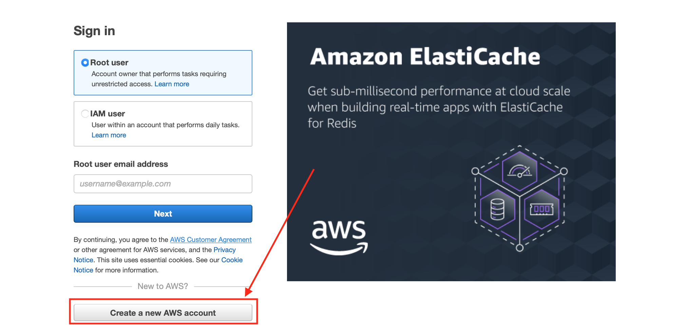
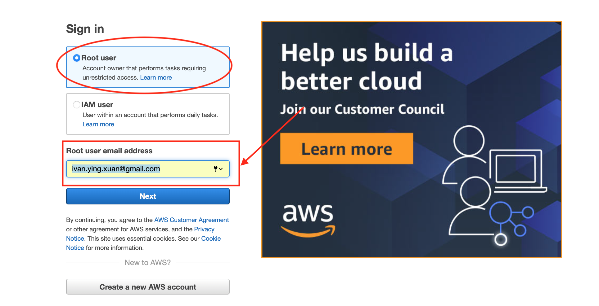

# Download files from an S3 Bucket using *requests*

This small step by step tutorial will guide you to:

- Create an AWS account
- Create an Amazon S3 bucket
- Download and configure the AWS CLI
- Make public the files in the bucket
- Upload your files
- Download the files from the bucket

## Create an Amazon S3 bucket

The first thing you have to do is creating an Amazon Web Service account , so go to the [AWS webpage](https://aws.amazon.com/). Click on the 'Sign In to the Console' button on the top right corner.


In the next window, click on the 'Create a new AWS account' button.


You will need to provide a credit card number, but don't worry! It won't charge you untill you use large amounts of resources.

Once you are done, go again to Sign In to the Console page and enter your data, leaving the 'Root User' marked, and then click Next:


## Create an S3 Bucket

In the search bar, type 'S3', and click on the first option:


In the next window, click on 'Create bucket':


Set a name for your bucket, and choose a region (any from US usually works fine).

## Create a IAM user 

In the search bar look for 'IAM' and click the first option:


Next, click User in the left-hand side, and then click 'Add User'


Then fill the user name with the name you want, tick programmatic access, and click Next


In the permissions page, select Attach existing policies directly, tick the AdministratorAccess and then click Next:


On the next pages, simply click Next and create the user. You will see the next page. This page contains your credentials for connecting to your S3 bucket. These credentials will only show once, so make sure to download the .csv file:


## Download and configure AWS CLI

If you are using Python, you should be familiar with the pip installer. Let's install awscli using:
`pip install awscli`

Next, in the terminal type `aws configure`
Enter the information as it appears in the .csv file you downloaded in the previous step. 

When you are asked about the region name, go to your S3 bucket and look at the AWS Region of your bucket. The region name looks something like 'us-east-1'

When asked about the output format, you can skip this info by pressing enter.

Now, your computer is ready to use boto3

## Using boto3 for using your AWS resources from Python

boto3 is a library that allows us to work with AWS from our python script. In this example we are going to simply upload, download and explore S3 buckets. 

First of all, install boto3 by typing in the terminal `pip install boto3`

boto3 has many classes. Let's start by telling to boto3 that we want to use an S3 bucket:
```
import boto3 
s3_client = boto3.client('s3')
```
Now, let's upload something to your bucket:
`response = s3_client.upload_file(file_name, bucket, object_name)`

*file_name* is the directory of the file you want to upload, *bucket* is the name of your S3 bucket, and *object_name* is the name you want to give to your file once uploaded


Try it yourself!

Now, let's see the content of the bucket:
```
import boto3
s3 = boto3.resource('s3')

my_bucket = s3.Bucket('bucket_name')

for file in my_bucket.objects.all():
    print(file.key)
```

Once you know the content of it, you can download the files:

```
s3 = boto3.client('s3')

s3.download_fileobj(bucket, file_name, object_name)
```

## Make public the files in the bucket

In your S3 buket, disable the 'Block all public access' option:


Once you created it, you can access to it in the bucket list, now you just need to make it public.


To make the objects public, go to http://awspolicygen.s3.amazonaws.com/policygen.html, which will help you create the necessary policy.<br>
- In 'Select Type of Policy' select S3 Bucket Policy. 
- In 'Principal' type ' * '
- In 'Actions' select 'Get Object'
- In 'Amazon Resource Name (ARN)' type arn:aws:s3:::{your_bucket_name}/*
- Press Statement
- Press Generate Policy and copy the text
  


Go back to your bucket and go to the Permissions tab. In 'Bucket Policy' click Edit. Paste the text you copied and save changes.<br> 
Now your bucket is publicly accesible, and anyone can download your files. 

## Upload your files from the webpage

Uploading files to a bucket is quite straightforward. Just go to the bucket and click Upload:


Select the files in 'Add files' or 'Add folder' and then click Upload

## Download the files from the bucket in the webpage

In your bucket, select the file you want to download, and copy the Object URL.


Open a python editor or notebook and use the requests library to download the image from the URL you just copied. Something like this:
```
import requests
# Change this with your URL
url = {YOUR URL}
response = requests.get(url)
with open('image.png', 'wb') as f:
    f.write(response.content)
```

And that's it, you should be able to see the file in the same working directory.